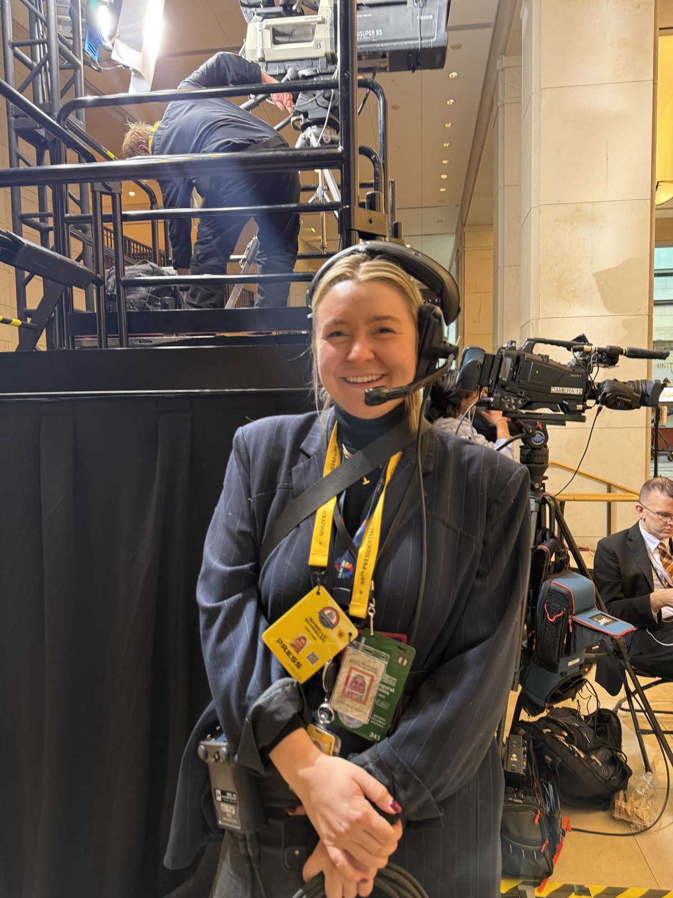

Isabelle Schmeler is a journalist with a passion for producing stories and writing about all
things politics. Her work spans field production, television packages, and original reporting
for NBC News.

She has field produced across every beat — politics, transportation, breaking news, and
long-form features — from presidential campaigns and inaugurations to congressional hearings
and live locations across the country. On any given story she is booking guests, coordinating
shoots, gathering elements, and turning around live shots on tight deadlines. She has also
written original articles and contributed to live blogs throughout her time at NBC.

**Get in touch:** [ischmeler18@gmail.com](mailto:ischmeler18@gmail.com)
